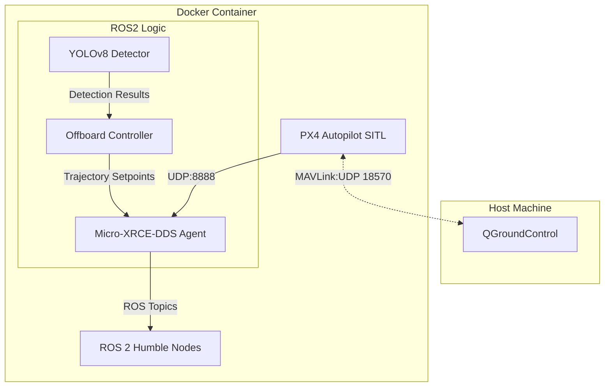

# Hunter Drone System

> Dockerized Autonomous Aerial Surveillance System with ROS 2 & PX4

[](https://docs.ros.org/en/humble/)
[](https://px4.io/)
[](https://www.docker.com/)
[](https://opensource.org/licenses/MIT)

## Overview

Hunter Drone System is a modular, containerized autonomous UAV development environment designed for ground target detection and tracking. This project integrates flight control dynamics, computer vision, and state estimation capabilities within a high-fidelity simulation environment.

Designed with scalability and portability in mind, the entire infrastructure runs on Docker, aiming to meet defense industry standards for robust software architecture.

**Current Status:** Phase 1 Complete - Docker Infrastructure, Robust Offboard Control & PX4 Integration.

| System Initialization | Offboard Flight (Armed) |
| :---: | :---: |
| *Terminals establishing DDS Bridge* | *Drone holding 5m altitude* |
|  |  |

---

## Technical Competencies

This project serves as a technical portfolio demonstrating engineering competencies in:

1.  **UAV Systems Engineering:** Flight dynamics, PX4 autopilot integration, MAVLink protocol communication.
2.  **DevOps & Simulation:** Docker containerization, Gazebo SITL/HITL simulation environments.
3.  **Robotics Middleware:** ROS 2 (Humble) architecture, topic/node orchestration, QoS (Quality of Service) management.
4.  **Defensive Programming:** Implementation of failsafes, handling communication losses, and resolving protocol mismatches (e.g., payload size verification).

**Target Industry:** Defense Systems & Autonomous Robotics.

---

## System Architecture

The project utilizes a Microservices architecture where the simulation, control logic, and DDS bridge run as isolated but interconnected services.


### Communication Flow
```
ROS 2 Nodes  ←→  Micro-XRCE-DDS  ←→  PX4 uORB  ←→  Gazebo Physics
  (Python)      (UDP Port 8888)     (MAVLink)      (Simulation)
                                         ↕
                                   QGroundControl
                                  (UDP Port 18570)
```

---

## Technology Stack

| Domain | Technology | Purpose |
| :--- | :--- | :--- |
| **Containerization** | Docker & Compose | Isolated, reproducible development environment |
| **Robotics Framework** | ROS 2 Humble | High-level control and perception logic |
| **Flight Control** | PX4 Autopilot v1.14 | Low-level flight stabilization and estimation |
| **Simulation** | Gazebo Classic | Physics engine and sensor simulation |
| **Communication** | Micro-XRCE-DDS | RTPS bridge between ROS 2 and PX4 |
| **Computer Vision** | YOLOv8 + OpenCV | Real-time object detection (Phase 2) |
| **Language** | Python 3.10 / C++ | Algorithm implementation |

---

## Quick Start (Docker)

The entire system is containerized, eliminating the need to install ROS 2 or PX4 natively on the host machine.

### Prerequisites
* Docker & Docker Compose
* NVIDIA GPU (Recommended for Gazebo GUI)
* X11 forwarding for GUI (Linux/Mac) or XLaunch (Windows)
* QGroundControl (Installed on Host)

### 1. Clone & Build
```bash
git clone https://github.com/mertaren/hunter_drone.git
cd hunter_drone

# Build and start the entire simulation environment
docker compose up --build
```

### 2. Run the Controller
```bash
# If container is not running, start it detached:
docker compose up -d

# Open a new terminal into the container
docker exec -it hunter_drone_container bash

# Inside the container, launch the Offboard Controller
ros2 run hunter_drone_control simple_controller
```

### 3. Monitor with QGroundControl
* Open QGroundControl on your host machine
* It should auto-connect to `udp://localhost:18570`
* Observe telemetry and flight status

---

## Docker Configuration

Key services defined in `docker-compose.yml`:

| Service | Ports | Purpose |
|---------|-------|---------|
| hunter_drone | 8888 (UDP) | Micro-XRCE-DDS Agent |
| hunter_drone | 18570 (UDP) | MAVLink (QGroundControl) |
| hunter_drone | 14550 (UDP) | MAVLink (Backup/Secondary GCS) |

**Environment Variables:**
- `DISPLAY`: X11 forwarding for Gazebo GUI
- `ROS_DOMAIN_ID`: 0 (default, change if running multiple ROS systems)
- `PX4_SIM_MODEL`: iris (change to `iris_depth_camera` in Phase 2)

---

## Development Roadmap

### Phase 1: Foundation ✅ (Completed)
- [x] Docker Environment Setup (ROS2 + PX4 + Gazebo)
- [x] Micro-XRCE-DDS Bridge Configuration
- [x] Protocol Mismatch Resolution (Payload size handling)
- [x] Basic Offboard Control (Arming, Takeoff & Position Hold)
- [x] MAVLink telemetry integration with QGroundControl

### Phase 2: Perception 🔄 (In Progress)
- [ ] Switch PX4 model from `iris` to `iris_depth_camera`
- [ ] Configure depth camera parameters (FOV, resolution)
- [ ] YOLOv8 Real-time Inference on `/camera/image_raw` topic
- [ ] Coordinate Transformation (Pixel to NED World Frame)
- [ ] Bounding box visualization in RViz2

### Phase 3: State Estimation 📅 (Planned)
- [ ] Extended Kalman Filter for target tracking
- [ ] Sensor fusion (Camera + GPS + IMU)
- [ ] Prediction during occlusions
- [ ] Track persistence with unique IDs

### Phase 4: Autonomy 📅 (Planned)
- [ ] Visual servoing (Center target in frame)
- [ ] Pursuit controller (Follow moving targets)
- [ ] Search pattern implementation
- [ ] Mission state machine (SEARCH → TRACK → PURSUE → RTL)

---

## Repository Structure

The project follows a standard ROS 2 workspace structure within a Dockerized environment.
```text
hunter_drone/
├── docker/
│   └── Dockerfile                    # System environment and dependencies
├── src/
│   ├── hunter_drone_control/         # Main control package
│   │   ├── hunter_drone_control/
│   │   │   ├── __init__.py
│   │   │   ├── simple_controller.py  # Offboard control logic (Phase 1)
│   │   │   └── yolo_detector.py      # Object detection node (Phase 2)
│   │   ├── launch/
│   │   │   └── offboard_control.launch.py
│   │   ├── config/
│   │   │   └── controller_params.yaml
│   │   ├── package.xml
│   │   └── setup.py
│   └── px4_msgs/                     # MAVLink to ROS 2 message definitions
├── docs/
│   ├── images/                       # Project screenshots and diagrams
│   └── setup_guide.md                # Detailed installation instructions
├── docker-compose.yml                # Service orchestration configuration
├── LICENSE                           # MIT License
└── README.md                         # Project documentation
```

---

## Performance Metrics

| Metric | Target | Current Status |
|--------|--------|----------------|
| Control Loop Frequency | 20 Hz | ✅ 20 Hz |
| DDS Bridge Latency | <20 ms | ✅ ~10 ms |
| Container Startup Time | <60s | ✅ ~45s |
| Position Hold Accuracy | <0.5m RMS | 🔄 Testing |
| Detection Framerate (Phase 2) | >20 FPS | 📅 Planned |

---

## Troubleshooting

### Container fails to start
```bash
# Check Docker daemon status
sudo systemctl status docker

# Check GPU drivers (if using Gazebo GUI)
nvidia-smi

# Verify Docker Compose version
docker compose version
```

### No PX4 topics visible in ROS 2
```bash
# Inside container, check if DDS agent is running
ps aux | grep MicroXRCEAgent

# List available ROS topics (should see /fmu/*)
ros2 topic list

# Restart DDS agent if needed
pkill MicroXRCEAgent
MicroXRCEAgent udp4 -p 8888 &
```

### QGroundControl cannot connect
- Ensure port 18570 is exposed in `docker-compose.yml`
- Check host firewall settings: `sudo ufw status`
- Verify PX4 is broadcasting MAVLink:
```bash
  # Inside container
  netstat -ulnp | grep 18570
```

### Gazebo GUI not displaying (X11 issues)
```bash
# On host, allow Docker to access X server
xhost +local:docker

# Verify DISPLAY variable inside container
docker exec -it hunter_drone_container bash -c "echo $DISPLAY"
```

### Drone won't arm
- Check PX4 pre-arm checks in QGroundControl
- Verify offboard control mode is enabled: `COM_RCL_EXCEPT = 4`
- Ensure setpoints are being published at >2 Hz:
```bash
  ros2 topic hz /fmu/in/trajectory_setpoint
```

---

## Demonstrations

📹 **Video Walkthrough:** [YouTube Link] (coming soon)

**Current Capabilities:**
- ✅ Automated arming sequence
- ✅ Offboard mode transition
- ✅ Autonomous takeoff to 5m altitude
- ✅ Stable position hold (NED frame)
- ✅ Clean shutdown and disarm

---

## References

### PX4 Documentation
- [Offboard Control Guide](https://docs.px4.io/main/en/ros/ros2_comm.html)
- [MAVROS vs Micro-XRCE-DDS](https://docs.px4.io/main/en/middleware/uxrce_dds.html)
- [PX4 SITL Simulation](https://docs.px4.io/main/en/simulation/)

### ROS 2 Best Practices
- [Quality of Service Settings](https://docs.ros.org/en/humble/Concepts/About-Quality-of-Service-Settings.html)
- [ROS 2 Launch System](https://docs.ros.org/en/humble/Tutorials/Intermediate/Launch/Launch-Main.html)

### Industry Standards
- DO-178C: Software Considerations in Airborne Systems
- STANAG 4586: Standard Interfaces of UAV Control System (UCS)

---

## Author

**Mert Aren**
- Statistics Student specializing in Autonomous Systems
- **Focus:** UAV Control, Sensor Fusion, Computer Vision
- **Career Goal:** Defense Industry (ASELSAN, Baykar, TUSAŞ)
- **Contact:** 
  - GitHub: [@mertaren](https://github.com/mertaren)
  - Email: mertcodes@gmail.com

---

## Contributing

This is a personal portfolio project, but feedback and suggestions are welcome!

1. Fork the repository
2. Create a feature branch (`git checkout -b feature/YourFeature`)
3. Commit your changes (`git commit -m 'Add: Your feature description'`)
4. Push to the branch (`git push origin feature/YourFeature`)
5. Open a Pull Request

---

## License

This project is licensed under the MIT License - see [LICENSE](LICENSE) file for details.

---

## Acknowledgments

- **PX4 Development Team** - Robust autopilot framework
- **ROS 2 Community** - Excellent robotics middleware
- **Gazebo Team** - High-fidelity simulation environment
- **Docker Community** - Containerization best practices

---

<div align="center">

**⭐ Star this repository if you find it helpful!**

Built with ❤️ for autonomous systems

</div>