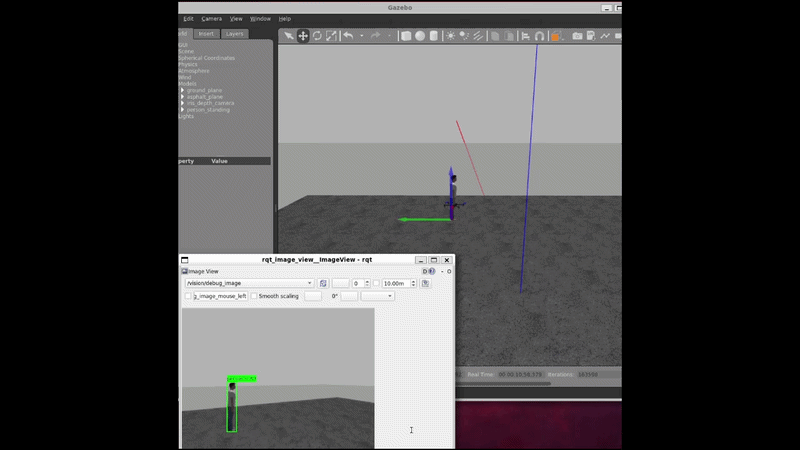
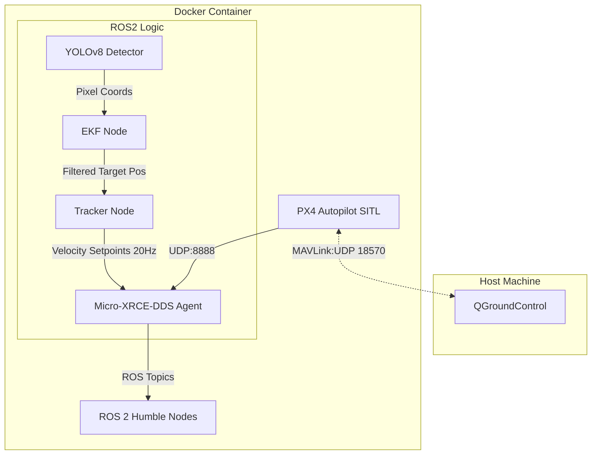

# 🚁 Hunter Drone — Autonomous Target Tracking & Interception
**ROS 2 Humble · PX4 Autopilot · Gazebo Classic · Docker**

[](https://docs.ros.org/en/humble/)
[](https://px4.io/)
[](https://www.docker.com/)
[](https://opensource.org/licenses/MIT)

## Why This Project?

Most open-source drone projects keep the vehicle at a safe distance from the target and just pan the camera. I wanted to push the system to its limits: the drone extracts real-time 3D world coordinates of a YOLO-detected target from EKF-filtered camera data and flies directly at it in PX4 Offboard mode. There is no "safe distance" logic here.

The entire development runs inside a Dockerized environment using ROS 2 Humble, PX4 Autopilot, and Gazebo.

**Current Status:** Phase 2 complete — EKF integration and Tracker Node(Kamikaze) are active.

### Flight Demos
| Kamikaze Mode (Zero Distance) | Stalker Mode (3m Safe Distance) |
| :---: | :---: |
| *Drone ignores safe distance and intercepts the target directly at head-level.* | *Drone aggressively tracks but maintains a strict 3m operational radius.* |
|  |  |

---

## What I Built

### 2D Pixels → 3D World Coordinates (Pinhole Camera Math)
Getting YOLO's 2D bounding boxes was the easy part. The real challenge was converting those pixel coordinates into Global NED (North-East-Down) coordinates by **dynamically reading** the camera's intrinsic parameters (`fx`, `fy`, `cx`, `cy`) from the `/camera_info` topic at runtime — instead of hardcoding calibration values. This makes the system work regardless of which camera model is attached.

### EKF (Extended Kalman Filter) Integration
Sensor noise and sudden outlier jumps in distance estimates were corrupting the controller. I wrote an EKF node from scratch to fix this. The filter rejects measurements where the **Mahalanobis distance** exceeds a threshold, and guards against `NaN`/`Inf` values leaking into the Offboard controller and crashing autonomous flight.

### Custom Offboard Controller (Kamikaze Tracker)
I built a controller that drives the drone in PX4 Offboard mode by publishing velocity commands at 20 Hz. I completely removed the "maintain safe distance" logic and replaced it with an aggressive **error vector approach** — the drone descends to the target's head level (`target_z - 1.0 m`) and flies straight at it until the error reaches zero.

---

## Bugs I Hit & How I Fixed Them

**The Runaway Bug:** In early tests, the closer the drone got to the target, the faster it flew away. After a few hours of log analysis I traced it back to the standard `safe_distance` algorithm fighting against the pursuit logic. I removed the distance-keeping controller entirely and rewrote it to zero out the error vector instead. Problem gone.

**FOV & FPS Tradeoff Breaking EKF:** When I lowered camera resolution to squeeze more FPS out of the simulation, the EKF started producing completely nonsensical coordinates. I went through all the SDF files in the environment, reset them to baseline (640×480, 60° FOV), and moved the calibration to dynamic ROS 2 subscription instead of hardcoded values. That fixed it.

---

## System Architecture

The simulation, control logic, and DDS bridge run as isolated but interconnected services.


```mermaid
graph TD
    subgraph Host Machine
        QGC[QGroundControl]
    end

    subgraph Docker Container
        PX4[PX4 Autopilot SITL] -- UDP:8888 --> DDS[Micro-XRCE-DDS Agent]
        DDS -- ROS Topics --> ROS2[ROS 2 Humble Nodes]

        subgraph ROS2 Logic
            EKF[EKF Node] -- Filtered Target Pos --> Control[Tracker Node]
            Vision[YOLOv8 Detector] -- Pixel Coords --> EKF
            Control -- Velocity Setpoints 20Hz --> DDS
        end

        PX4 <-.-> |MAVLink:UDP 18570| QGC
    end
```

### Communication Flow
```
ROS 2 Nodes  ←→  Micro-XRCE-DDS  ←→  PX4 uORB  ←→  Gazebo Physics
  (Python)      (UDP Port 8888)     (MAVLink)      (Simulation)
                                         ↕
                                   QGroundControl
                                  (UDP Port 18570)
```

---

## Technology Stack

| Domain | Technology | Purpose |
| :--- | :--- | :--- |
| **Containerization** | Docker & Compose | Isolated, reproducible dev environment |
| **Robotics Framework** | ROS 2 Humble | High-level control and perception logic |
| **Flight Control** | PX4 Autopilot v1.14 | Low-level flight stabilization |
| **Simulation** | Gazebo Classic | Physics engine and sensor simulation |
| **Communication** | Micro-XRCE-DDS | RTPS bridge between ROS 2 and PX4 |
| **Computer Vision** | YOLOv8 + OpenCV | Real-time object detection |
| **State Estimation** | Extended Kalman Filter | Noise suppression, outlier rejection |
| **Language** | Python 3.10 | Algorithm implementation |

---

## How to Run

The whole system is containerized — no need to install ROS 2 or PX4 natively.

### Prerequisites
- Docker & Docker Compose
- NVIDIA GPU (recommended for Gazebo GUI)
- X11 forwarding (Linux/Mac) or XLaunch (Windows)
- QGroundControl installed on host machine

### 1. Clone & Build
```bash
git clone https://github.com/mertaren/hunter_drone.git
cd hunter_drone

docker compose up --build
```

### 2. Run the Controllers
```bash
# Start container in background if not already running
docker compose up -d

# Open a shell inside the container
docker exec -it hunter_drone_container bash

# Build and source the workspace
cd /ros2_ws && colcon build --symlink-install
source install/setup.bash

# Start the EKF node
ros2 run hunter_drone_control ekf_node &

# Start the Kamikaze Tracker
ros2 run hunter_drone_control tracker_node
```

### 3. Monitor with QGroundControl
Open QGroundControl on the host — it auto-connects to `udp://localhost:18570`.

---

## Roadmap

### Phase 1: Infrastructure ✅
- [x] Docker environment (ROS 2 + PX4 + Gazebo)
- [x] Micro-XRCE-DDS bridge configuration
- [x] Payload size mismatch resolution
- [x] Basic Offboard control (arm, takeoff, position hold)
- [x] QGroundControl MAVLink integration

### Phase 2: Perception & Tracking ✅
- [x] Switch to `iris_depth_camera` model
- [x] Dynamic camera calibration from `/camera_info`
- [x] YOLOv8 real-time inference on camera topic
- [x] Pixel → NED coordinate transform (Pinhole model)
- [x] EKF node (Mahalanobis outlier rejection + NaN/Inf guard)
- [x] Kamikaze Tracker controller (tracker_node)

### Phase 3: Advanced Autonomy 📅
- [ ] **Occlusion Handling:** When the target moves behind an obstacle, use EKF velocity vectors to predict where it will re-emerge
- [ ] **Track Persistence:** Integrate DeepSORT to maintain target identity when multiple people are in the scene
- [ ] Mission state machine: `SEARCH → LOCK → PURSUE → RTL`

---

## Repository Structure

```text
hunter_drone/
├── docker/
│   └── Dockerfile                      # System environment and dependencies
├── src/
│   ├── hunter_drone_control/
│   │   ├── hunter_drone_control/
│   │   │   ├── ekf_node.py             
│   │   │   ├── tracker_node.py     
│   │   │   └── yolo_detector.py        
│   │   ├── launch/
│   │   │   └── hunter.launch.py
│   │   ├── config/
│   │   │   └── ekf_params.yaml
│   │   ├── package.xml
│   │   └── setup.py
│   ├── px4_msgs/                       # MAVLink → ROS 2 message definitions
│   └── PX4-Autopilot/
├── docs/
│   └── images/
├── docker-compose.yml
└── README.md
```

---

## Troubleshooting

### No PX4 topics visible in ROS 2
```bash
ps aux | grep MicroXRCEAgent
ros2 topic list   # should show /fmu/* topics

# Restart DDS agent if needed
pkill MicroXRCEAgent && MicroXRCEAgent udp4 -p 8888 &
```

### Drone won't arm
- Check pre-arm warnings in QGroundControl
- Verify `COM_RCL_EXCEPT = 4` is set
- Confirm setpoints are publishing at 20 Hz:
```bash
ros2 topic hz /fmu/in/trajectory_setpoint
```

### Gazebo GUI not showing (X11)
```bash
xhost +local:docker
docker exec -it hunter_drone_container bash -c "echo $DISPLAY"
```

### EKF producing garbage coordinates
Check camera settings in SDF files — should be 640×480, 60° FOV:
```bash
ros2 topic echo /camera_info --once
```

---

## References

- [PX4 Offboard Control Guide](https://docs.px4.io/main/en/ros/ros2_comm.html)
- [Micro-XRCE-DDS Documentation](https://docs.px4.io/main/en/middleware/uxrce_dds.html)
- [ROS 2 QoS Settings](https://docs.ros.org/en/humble/Concepts/About-Quality-of-Service-Settings.html)

---

## Author

**Mert Yalçıner** · [@mertaren](https://github.com/mertaren) · mertcodes@gmail.com

---

## License

MIT License — see [LICENSE](LICENSE) for details.

---

<div align="center">

**⭐ Star the repo if you find it useful!**
